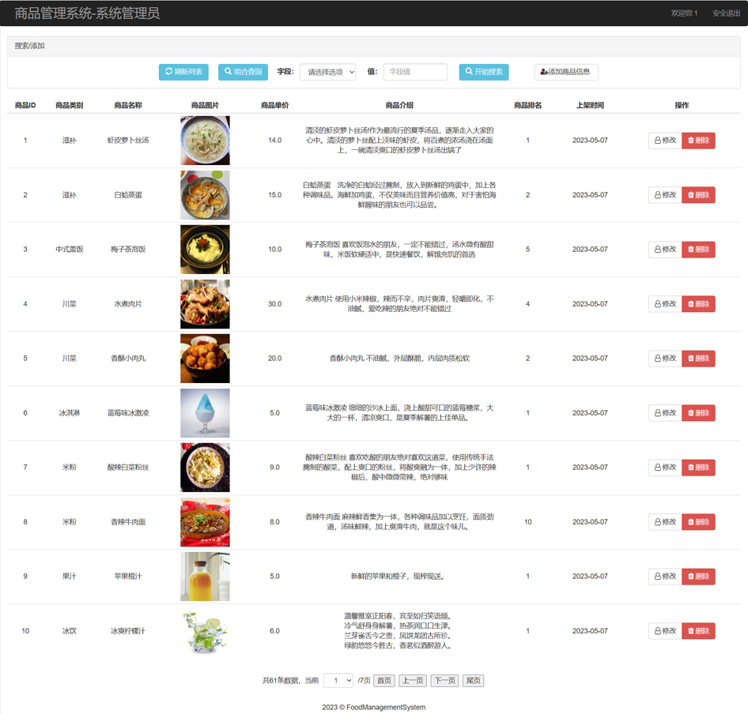

# Commodity Management System

        

This is my assignment for the web development course. Using JSP+Servlet to implement an administrator end of a Product Management System.

# 📃Description

This is the administrator end of a product management system. In this project, the administrator can perform basic operations such as adding, deleting, modifying, and querying in the system.

# 📝Table of Contents
- [Commodity Management System](#commodity-management-system)
- [Description](#description)
- [Table of Contents](#table-of-contents)
- [Installation](#installation)
- [Usage](#usage)
- [Screenshots](#screenshots)

# 🚀Installation

Fork this repository and clone by this command

```shell
git clone https://github.com/<your-username>/commodity-management-aystem.git
```

import webdatabase.sql into your database, start the server with Tomcat, and open the interface through WebContent\login. jsp

# 💼Usage

On the administrator side, you can create new users, view all product details (including images, numbers, unit prices, sales rankings, etc.), and modify and delete them. The project also provides multiple search methods and pagination queries.

# 📸Screenshots



